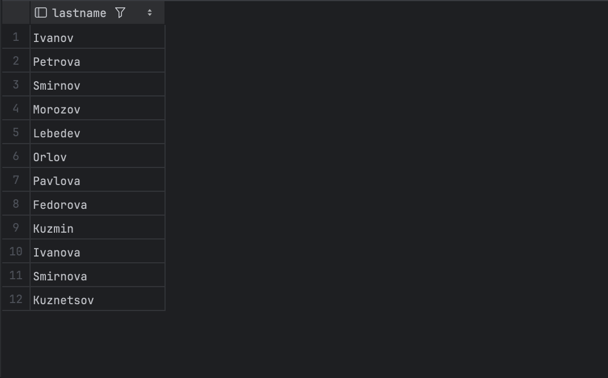
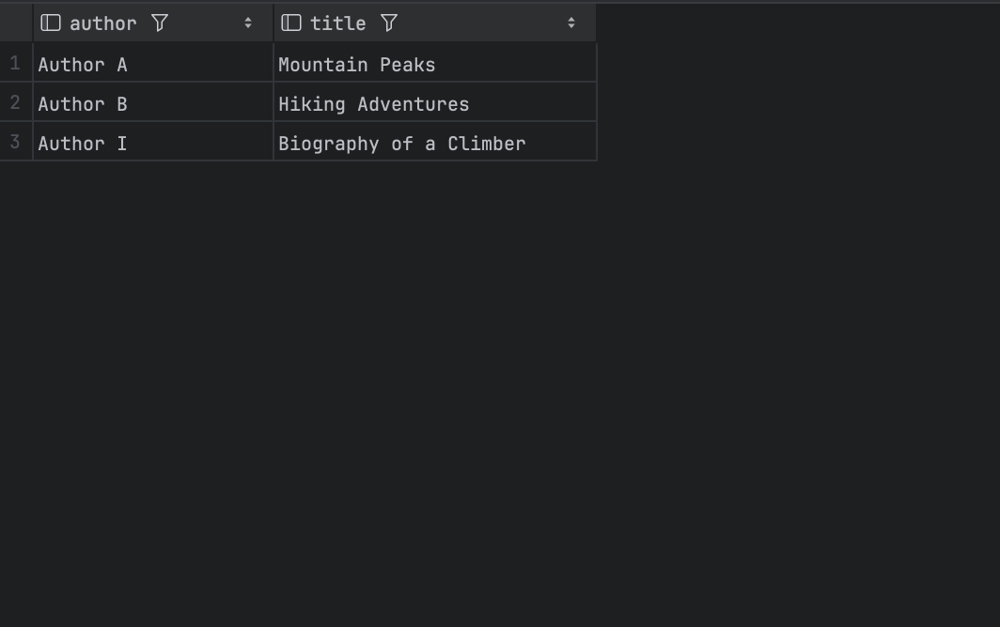
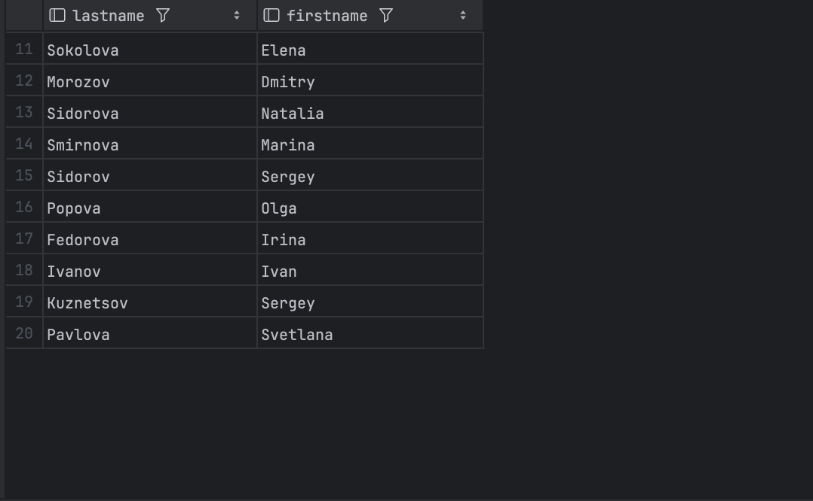
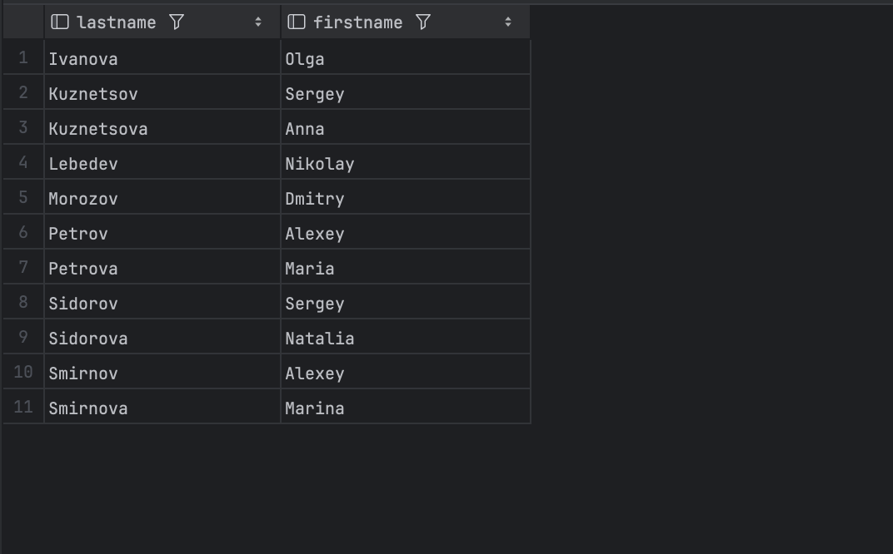

# Homework 5

## Task 1

a) Какие фамилии читателей в Москве? <br>

```sql
SELECT LastName
FROM Reader
WHERE Address LIKE '%Moscow%';
```
Output:


b) Какие книги (author, title) брал Иван Иванов? <br>

```sql
SELECT DISTINCT Book.Author, Book.Title
FROM Borrowing
         JOIN Reader ON Borrowing.ReaderNr = Reader.ID
         JOIN Book ON Borrowing.ISBN = Book.ISBN
WHERE Reader.lastname = 'Ivanov'
  AND Reader.FirstName = 'Ivan';
```
Output:


c) Какие книги (ISBN) из категории "Горы" не относятся к категории "Путешествия"? Подкатегории не обязательно принимать
во внимание! <br>

```sql
SELECT DISTINCT bc1.ISBN
FROM BookCat bc1
WHERE bc1.CategoryName = 'Mountains'
  AND bc1.ISBN NOT IN (SELECT bc2.ISBN
                       FROM BookCat bc2
                       WHERE bc2.CategoryName = 'Travel');
```
Output:

d) Какие читатели (LastName, FirstName) вернули копию книги? <br>

```sql
SELECT DISTINCT Reader.LastName, Reader.FirstName
FROM Borrowing
         JOIN Reader ON Borrowing.ReaderNr = Reader.ID
WHERE Borrowing.ReturnDate < NOW();
```
Output:

e) Какие читатели (LastName, FirstName) брали хотя бы одну книгу (не копию), которую брал также Иван Иванов (не
включайте Ивана Иванова в результат)? <br>

```sql
SELECT DISTINCT R.LastName, R.FirstName
FROM Borrowing B
         JOIN Reader R ON B.ReaderNr = R.ID
WHERE B.ISBN IN (SELECT ISBN
                 FROM Borrowing
                 WHERE ReaderNr = (SELECT ID
                                   FROM Reader
                                   WHERE LastName = 'Ivanov'
                                     AND FirstName = 'Ivan'))
  AND R.ID != (SELECT ID
               FROM Reader
               WHERE LastName = 'Ivanov'
                 AND FirstName = 'Ivan');
```
Output:
