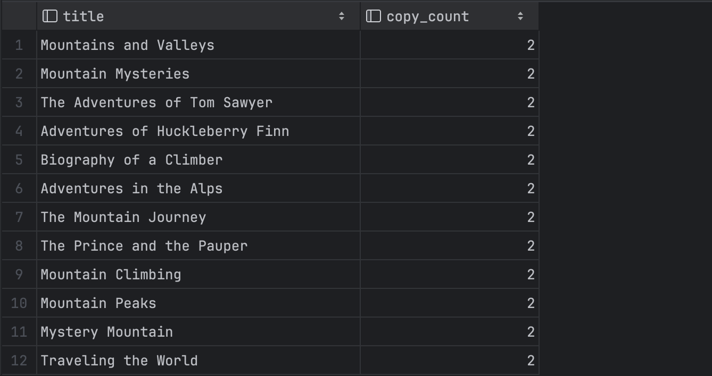
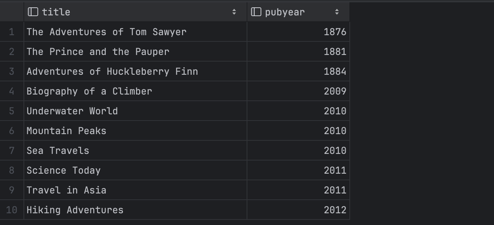

# Homework 6

## Task 1
Показать все названия книг вместе с именами издателей.
```sql
SELECT Title, PubName
FROM Book;
```


В какой книге наибольшее количество страниц?
```sql
SELECT ISBN, Title
FROM Book
ORDER BY PagesNum DESC
LIMIT 1;
```


Какие авторы написали более 5 книг?
```sql
SELECT book.author
FROM book
GROUP BY book.author
HAVING COUNT(book.author) >= 5;
```


В каких книгах более чем в два раза больше страниц, чем среднее количество страниц для всех книг?
```sql  
SELECT book1.title
FROM book book1
WHERE book1.pagesnum > 2 * (SELECT AVG(book2.pagesnum)
                            FROM book book2);
```


Какие категории содержат подкатегории?
```sql
SELECT DISTINCT cat.categoryname
FROM category cat
JOIN category child ON cat.categoryname = child.parentcat
WHERE child.parentcat IS NOT NULL;
```


У какого автора (предположим, что имена авторов уникальны) написано максимальное количество книг?
```sql
SELECT book.author, COUNT(*)
FROM book
GROUP BY book.author
ORDER BY COUNT(book.author) DESC
LIMIT 1;
```


Какие читатели забронировали все книги (не копии), написанные "Марком Твеном"?
```sql
SELECT r.ID, r.FirstName, r.LastName
FROM Reader r
WHERE NOT EXISTS (
    SELECT b.ISBN
    FROM Book b
    WHERE b.Author = 'Mark Twain'
    AND NOT EXISTS (
        SELECT br.ISBN
        FROM Borrowing br
        WHERE br.ReaderNr = r.ID
        AND br.ISBN = b.ISBN
    )
);
```


Какие книги имеют более одной копии?
```sql
SELECT b.title, COUNT(c.copynumber) AS copy_count
FROM book b
INNER JOIN public.copy c ON c.isbn = b.isbn
GROUP BY b.isbn, b.title
HAVING COUNT(c.copynumber) > 1;
```


ТОП 10 самых старых книг
```sql
SELECT title, pubyear
FROM book
ORDER BY pubyear
LIMIT 10;
```


Перечислите все категории в категории "Спорт"
```sql
WITH RECURSIVE category_tree AS (
    SELECT categoryname, parentcat
    FROM category
    WHERE parentcat = 'Sport'
    UNION ALL
    SELECT c.categoryname, c.parentcat
    FROM category c
    JOIN category_tree ct ON c.parentcat = ct.categoryname
)
SELECT categoryname
FROM category_tree;
```


## Task 2
Добавьте запись о бронировании читателем ‘Василеем Петровым’ книги с ISBN 123456 и номером копии 4.
```sql
INSERT INTO book (ISBN, Title, Author, PagesNum, PubYear, PubName)
VALUES ('123456', 'Book1', 'Author1', 100, 2020, 'Mountains Press');

INSERT INTO copy (ISBN, CopyNumber, ShelfPosition)
VALUES ('123456', 4, 1);

INSERT INTO Reader (ID, LastName, FirstName, Address, BirthDate)
VALUES (21, 'Petrov', 'Vasiliy', 'Moscow, 123 Main St', '1980-05-15');

INSERT INTO borrowing (ReaderNr, ISBN, CopyNumber, ReturnDate)
VALUES (21, '123456', 4, '2023-04-15');

SELECT *
FROM borrowing
JOIN reader ON borrowing.readernr = reader.id;
```


Удалить все книги, год публикации которых превышает 2000 год.
```sql
DELETE FROM Borrowing
WHERE ISBN IN (SELECT ISBN FROM Book WHERE PubYear > 2000);

DELETE FROM BookCat
WHERE ISBN IN (SELECT ISBN FROM Book WHERE PubYear > 2000);

DELETE FROM Copy
WHERE ISBN IN (SELECT ISBN FROM Book WHERE PubYear > 2000);

DELETE FROM Book
WHERE PubYear > 2000;

SELECT *
FROM book;
```


Измените дату возврата для всех книг категории "Базы данных", начиная с 01.01.2016, чтобы они были в заимствовании на 30 дней дольше (предположим, что в SQL можно добавлять числа к датам)
```sql
INSERT INTO category (CategoryName, ParentCat)
VALUES ('Databases', NULL);

INSERT INTO book (ISBN, Title, Author, PagesNum, PubYear, PubName)
VALUES
    ('1234567890123', 'Designing Data-Intensive Applications: The Big Ideas Behind Reliable', 'Author2', 100, 2017, 'Mountains Press'),
    ('1234567890124', 'SQL Performance Explained', 'Author3', 100, 2018, 'Mountains Press'),
    ('1234567890125', 'SQL Antipatterns: Avoiding the Pitfalls of Database Programming', 'Author4', 100, 2019, 'Mountains Press');

INSERT INTO bookcat (ISBN, CategoryName)
VALUES
    ('1234567890123', 'Databases'),
    ('1234567890124', 'Databases'),
    ('1234567890125', 'Databases');

INSERT INTO copy (ISBN, CopyNumber, ShelfPosition)
VALUES
    ('1234567890123', 1, 1),
    ('1234567890124', 1, 1),
    ('1234567890125', 1, 1);

INSERT INTO borrowing (ReaderNr, ISBN, CopyNumber, ReturnDate)
VALUES
    (21, '1234567890123', 1, '2016-01-01'),
    (21, '1234567890124', 1, '2016-01-01'),
    (21, '1234567890125', 1, '2016-01-01');

UPDATE borrowing
SET ReturnDate = ReturnDate + INTERVAL '30 days'
WHERE ISBN IN (SELECT ISBN FROM bookcat WHERE CategoryName = 'Databases')
  AND ReturnDate >= '2016-01-01';

SELECT * FROM borrowing;
```


## Task 3
1) Первый запрос выбирает имена и номера студентов, у которых нет оценок больше или равных 4.0. То есть, это список студентов, которые либо не сдавали экзамены, либо получили только оценки ниже 4.0.
2) Второй запрос создает список всех профессоров с суммой кредитов по их лекциям. Если профессор не ведет никаких лекций, для него будет показано 0 кредитов. Результат включает номер профессора, его имя и суммарное количество кредитов.
3) Третий запрос выбирает имена студентов и их наивысшие оценки (которые >= 4). Для каждого студента показывается только его лучшая оценка из всех его оценок, и только если она не менее 4 баллов.