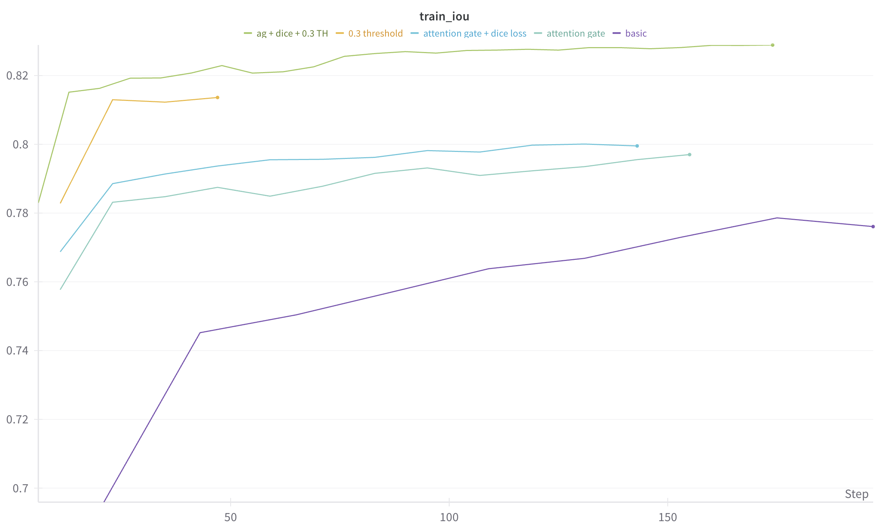

# Segmentation Homework

Homework is organized into modular components, each focusing on a different aspect of the pipeline, from configuration to training. The experiments are tracked using Weights & Biases (W&B), with model weights stored as artifacts on both W&B and Yandex Disk.

## Notebook Structure

The training part of notebook is divided into four key parts:

1. **Config**: Contains a `dataclass` structure that manages hyperparameters for training, dataset settings, and the IoU threshold for evaluation.
  
2. **Dataset**: Defines a dataset-loading class that handles all preprocessing and augmentation transformations required for model training and validation.

3. **Model**: Contains modules defining the model architecture.

4. **Training**: Implements a class for training and evaluation, including utilities for logging results with W&B.

## Experimentation

In this series of experiments, various strategies were tested to improve segmentation performance, focusing primarily on enhancing the UNet model architecture. Below is a summary of the main steps and insights gathered:

1. **Basic UNet**: Started with a standard UNet, which yielded a 0.75 IoU score. This outcome indicated that the model might be too limited to capture the complexities inherent in the data.

2. **Attention Gates**: To allow the model to focus better on important regions, an Attention Gate like in more modern UNet architectures. This adjustment increased performance to 0.79 IoU.

3. **Further Enhancements**: Attempted model expansion, data augmentation, scheduler tuning, and moved from BCE to combination of BCE and Dice loss. Despite these adjustments, IoU remained steady at 0.79, suggesting a limitation in the model’s learning capacity or a configuration issue.

4. **One-Batch Overfitting Test**: To investigate possible limitations, a one-batch overfitting test was performed. Surprisingly, the model was unable to overfit even on this reduced data, pointing to potential configuration oversights or parameter limitations.

5. **Tuning the Prediction Threshold**: After running multile experiments on one-batch overfitting, it was determined that the prediction threshold was the main bottleneck. Lowering the threshold significantly boosted IoU without altering the loss. I also added automatric threshold optimization, however it was slow so it was later removed.

## References

- [Attention U-Net: Learning Where to Look for the Pancreas](https://arxiv.org/abs/1804.03999v3)
